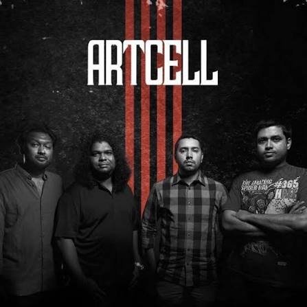

# 🎸 Artcell

[](https://github.com/GhostDog45/BD-Band-Music) [](#) [](#) [](#)

<p align="center">
  
</p>

## 🌟 About the Band

> **Artcell** is a pioneering Bangladeshi progressive metal and hard rock band formed in Dhaka in October 1999. Consisting of George Lincoln D'Costa (vocals/rhythm guitar), Ershad Zaman (lead guitar), Saef Al Nazi Cézanne (bass), and Kazi Sajjadul Asheqeen Shaju (drums), Artcell redefined Bangladeshi rock with intricate time signatures, deeply poetic philosophical lyrics, heavy progressive guitar riffs, and emotive power ballads. Widely recognized as architects of modern Bangladeshi progressive metal, Artcell's landmark albums *Onno Shomoy* and *Oniket Prantor* remain monumental masterworks in South Asian rock history.

---

## 📑 Discography Index

1. [Onno Shomoy (অন্য সময়) (2002)](#1-onno-shomoy-2002)
2. [Oniket Prantor (অনিকেত প্রান্তর) (2006)](#2-oniket-prantor-2006)
3. [Otritio (অতৃতীয়) (2023)](#3-otritio-2023)

---

<a id="1-onno-shomoy-2002"></a>
## 1. Onno Shomoy (অন্য সময়) (2002)

- **Band:** Artcell
- **Release Year:** 2002
- **Record Label:** G-Series
- **Audio Quality:** Lossless FLAC (16-bit / 44.1 kHz)

<p align="center">
  
</p>

### 📖 About the Album
Released in 2002 under G-Series, *Onno Shomoy* ("Another Time") is Artcell's revolutionary debut studio album that transformed the Bangladeshi underground rock landscape into a mainstream progressive phenomenon. Dedicated to the memory of Rupok (a close friend and lyricist who passed away from cerebral malaria), the album is renowned for complex rhythmic structures, blazing guitar solos, and emotionally staggering compositions including *"Onnoshomoy"*, *"Bhul Jonmo"*, *"Poth Chola"*, *"Rupok (Ekti Gan)"*, and *"Olosh Shomoyer Pare"*.

### 🎵 Tracklist (One-Tap Download)

- [**01 Onnoshomoy**](https://media.githubusercontent.com/media/GhostDog45/Artcell/master/Onno%20Shomoy/01-01%20Onnoshomoy.flac?download=true) &nbsp; [](https://media.githubusercontent.com/media/GhostDog45/Artcell/master/Onno%20Shomoy/01-01%20Onnoshomoy.flac?download=true)
- [**02 Bhul Jonmo**](https://media.githubusercontent.com/media/GhostDog45/Artcell/master/Onno%20Shomoy/01-02%20Bhul%20Jonmo.flac?download=true) &nbsp; [](https://media.githubusercontent.com/media/GhostDog45/Artcell/master/Onno%20Shomoy/01-02%20Bhul%20Jonmo.flac?download=true)
- [**03 Poth Chola**](https://media.githubusercontent.com/media/GhostDog45/Artcell/master/Onno%20Shomoy/01-03%20Poth%20Chola.flac?download=true) &nbsp; [](https://media.githubusercontent.com/media/GhostDog45/Artcell/master/Onno%20Shomoy/01-03%20Poth%20Chola.flac?download=true)
- [**04 Rupok (Ekti Gan)**](https://media.githubusercontent.com/media/GhostDog45/Artcell/master/Onno%20Shomoy/01-04%20Rupok%20%28Ekti%20Gan%29.flac?download=true) &nbsp; [](https://media.githubusercontent.com/media/GhostDog45/Artcell/master/Onno%20Shomoy/01-04%20Rupok%20%28Ekti%20Gan%29.flac?download=true)
- [**05 Mukhosh**](https://media.githubusercontent.com/media/GhostDog45/Artcell/master/Onno%20Shomoy/01-05%20Mukhosh.flac?download=true) &nbsp; [](https://media.githubusercontent.com/media/GhostDog45/Artcell/master/Onno%20Shomoy/01-05%20Mukhosh.flac?download=true)
- [**06 Rahur Grash**](https://media.githubusercontent.com/media/GhostDog45/Artcell/master/Onno%20Shomoy/01-06%20Rahur%20Grash.flac?download=true) &nbsp; [](https://media.githubusercontent.com/media/GhostDog45/Artcell/master/Onno%20Shomoy/01-06%20Rahur%20Grash.flac?download=true)
- [**07 Itihash (Shomoy-Odrishto)**](https://media.githubusercontent.com/media/GhostDog45/Artcell/master/Onno%20Shomoy/01-07%20Itihash%20%28Shomoy-Odrishto%29.flac?download=true) &nbsp; [](https://media.githubusercontent.com/media/GhostDog45/Artcell/master/Onno%20Shomoy/01-07%20Itihash%20%28Shomoy-Odrishto%29.flac?download=true)
- [**08 Kritrim Manush**](https://media.githubusercontent.com/media/GhostDog45/Artcell/master/Onno%20Shomoy/01-08%20Kritrim%20Manush.flac?download=true) &nbsp; [](https://media.githubusercontent.com/media/GhostDog45/Artcell/master/Onno%20Shomoy/01-08%20Kritrim%20Manush.flac?download=true)
- [**09 Obosh Onuvutir Deyal**](https://media.githubusercontent.com/media/GhostDog45/Artcell/master/Onno%20Shomoy/01-09%20Obosh%20Onuvutir%20Deyal.flac?download=true) &nbsp; [](https://media.githubusercontent.com/media/GhostDog45/Artcell/master/Onno%20Shomoy/01-09%20Obosh%20Onuvutir%20Deyal.flac?download=true)
- [**10 Olosh Shomoyer Pare**](https://media.githubusercontent.com/media/GhostDog45/Artcell/master/Onno%20Shomoy/01-10%20Olosh%20Shomoyer%20Pare.flac?download=true) &nbsp; [](https://media.githubusercontent.com/media/GhostDog45/Artcell/master/Onno%20Shomoy/01-10%20Olosh%20Shomoyer%20Pare.flac?download=true)

### 🖼️ Album Artwork

| | |
| :---: | :---: |
| <br><sub><b>1. Front Cover</b></sub> | <br><sub><b>2. Front Cover (Alternative Scan)</b></sub> |
| <br><sub><b>3. Gatefold Artwork</b></sub> | <br><sub><b>4. Booklet & Lyrics</b></sub> |
| <br><sub><b>5. Tray Inlay Artwork</b></sub> | <br><sub><b>6. Compact Disc (CD)</b></sub> |
| <br><sub><b>7. Back Inset</b></sub> | <br><sub><b>8. Back Cover</b></sub> |

---

<a id="2-oniket-prantor-2006"></a>
## 2. Oniket Prantor (অনিকেত প্রান্তর) (2006)

- **Band:** Artcell
- **Release Year:** 2006
- **Record Label:** G-Series
- **Audio Quality:** Lossless FLAC (16-bit / 44.1 kHz)

<p align="center">
  
</p>

### 📖 About the Album
Released in April 2006, *Oniket Prantor* ("No Man's Land") is widely regarded as one of the greatest progressive metal and conceptual rock albums ever created in Bengali musical history. Climaxing with the legendary 16-minute title epic *"Oniket Prantor"*, the album is a masterpiece of introspective songwriting, blistering guitar solos, and transcendent instrumental chemistry across tracks like *"Leen"*, *"Smriti Sharok"*, *"Dhushor Shomoy"*, *"Chayar Ninad"*, and *"Tomake"*.

### 🎵 Tracklist (One-Tap Download)

- [**01 Leen**](https://media.githubusercontent.com/media/GhostDog45/Artcell/master/Oniket%20Prantor/01-01%20Leen.flac?download=true) &nbsp; [](https://media.githubusercontent.com/media/GhostDog45/Artcell/master/Oniket%20Prantor/01-01%20Leen.flac?download=true)
- [**02 Smriti Sharok**](https://media.githubusercontent.com/media/GhostDog45/Artcell/master/Oniket%20Prantor/01-02%20Smriti%20Sharok.flac?download=true) &nbsp; [](https://media.githubusercontent.com/media/GhostDog45/Artcell/master/Oniket%20Prantor/01-02%20Smriti%20Sharok.flac?download=true)
- [**03 Dhushor Shomoy**](https://media.githubusercontent.com/media/GhostDog45/Artcell/master/Oniket%20Prantor/01-03%20Dhushor%20Shomoy.flac?download=true) &nbsp; [](https://media.githubusercontent.com/media/GhostDog45/Artcell/master/Oniket%20Prantor/01-03%20Dhushor%20Shomoy.flac?download=true)
- [**04 Pathor Bagan**](https://media.githubusercontent.com/media/GhostDog45/Artcell/master/Oniket%20Prantor/01-04%20Pathor%20Bagan.flac?download=true) &nbsp; [](https://media.githubusercontent.com/media/GhostDog45/Artcell/master/Oniket%20Prantor/01-04%20Pathor%20Bagan.flac?download=true)
- [**05 Shohid Shoroni**](https://media.githubusercontent.com/media/GhostDog45/Artcell/master/Oniket%20Prantor/01-05%20Shohid%20Shoroni.flac?download=true) &nbsp; [](https://media.githubusercontent.com/media/GhostDog45/Artcell/master/Oniket%20Prantor/01-05%20Shohid%20Shoroni.flac?download=true)
- [**06 Chayar Ninad**](https://media.githubusercontent.com/media/GhostDog45/Artcell/master/Oniket%20Prantor/01-06%20Chayar%20Ninad.flac?download=true) &nbsp; [](https://media.githubusercontent.com/media/GhostDog45/Artcell/master/Oniket%20Prantor/01-06%20Chayar%20Ninad.flac?download=true)
- [**07 Ghune Khawa Rodh**](https://media.githubusercontent.com/media/GhostDog45/Artcell/master/Oniket%20Prantor/01-07%20Ghune%20Khawa%20Rodh.flac?download=true) &nbsp; [](https://media.githubusercontent.com/media/GhostDog45/Artcell/master/Oniket%20Prantor/01-07%20Ghune%20Khawa%20Rodh.flac?download=true)
- [**08 Tomake**](https://media.githubusercontent.com/media/GhostDog45/Artcell/master/Oniket%20Prantor/01-08%20Tomake.flac?download=true) &nbsp; [](https://media.githubusercontent.com/media/GhostDog45/Artcell/master/Oniket%20Prantor/01-08%20Tomake.flac?download=true)
- [**09 Gontobbohin**](https://media.githubusercontent.com/media/GhostDog45/Artcell/master/Oniket%20Prantor/01-09%20Gontobbohin.flac?download=true) &nbsp; [](https://media.githubusercontent.com/media/GhostDog45/Artcell/master/Oniket%20Prantor/01-09%20Gontobbohin.flac?download=true)
- [**10 Oniket Prantor**](https://media.githubusercontent.com/media/GhostDog45/Artcell/master/Oniket%20Prantor/01-10%20Oniket%20Prantor.flac?download=true) &nbsp; [](https://media.githubusercontent.com/media/GhostDog45/Artcell/master/Oniket%20Prantor/01-10%20Oniket%20Prantor.flac?download=true)

### 🖼️ Album Artwork

| | |
| :---: | :---: |
| <br><sub><b>1. Front Cover</b></sub> | <br><sub><b>2. Booklet (Part 1)</b></sub> |
| <br><sub><b>3. Booklet (Part 2)</b></sub> | <br><sub><b>4. Booklet (Part 3)</b></sub> |
| <br><sub><b>5. Booklet (Part 4)</b></sub> | <br><sub><b>6. Booklet (Part 5)</b></sub> |
| <br><sub><b>7. Booklet (Part 6)</b></sub> | <br><sub><b>8. Booklet (Part 7)</b></sub> |
| <br><sub><b>9. Inset (Front)</b></sub> | <br><sub><b>10. Inlay (Part 1)</b></sub> |
| <br><sub><b>11. Compact Disc (CD)</b></sub> | <br><sub><b>12. Back Cover</b></sub> |

---

<a id="3-otritio-2023"></a>
## 3. Otritio (অতৃতীয়) (2023)

- **Band:** Artcell
- **Release Year:** 2023
- **Record Label:** Asiatic Mindshare
- **Audio Quality:** Lossless FLAC (16-bit / 44.1 kHz)

### 📖 About the Album
Marking Artcell's monumental return 17 years after *Oniket Prantor*, *Otritio* ("The Not-Third") embodies the band's matured sound, modern production, and relentless musical identity. Featuring hard-hitting riffs, signature progressive basslines, and reflective lyrical journeys, the album brings long-awaited studio master recordings of fan anthems and new compositions including *"Baksho Bondi"*, *"Biprotip"*, *"Oshomapto Shantona"*, and *"Smritir Ayna"*.

### 🎵 Tracklist (One-Tap Download)

- [**Artcell - Baksho Bondi**](https://media.githubusercontent.com/media/GhostDog45/Artcell/master/Otritio/Artcell%20-%20Baksho%20Bondi.flac?download=true) &nbsp; [](https://media.githubusercontent.com/media/GhostDog45/Artcell/master/Otritio/Artcell%20-%20Baksho%20Bondi.flac?download=true)
- [**Artcell - Biprotip**](https://media.githubusercontent.com/media/GhostDog45/Artcell/master/Otritio/Artcell%20-%20Biprotip.flac?download=true) &nbsp; [](https://media.githubusercontent.com/media/GhostDog45/Artcell/master/Otritio/Artcell%20-%20Biprotip.flac?download=true)
- [**Artcell - Oshomapto Shantona**](https://media.githubusercontent.com/media/GhostDog45/Artcell/master/Otritio/Artcell%20-%20Oshomapto%20Shantona.flac?download=true) &nbsp; [](https://media.githubusercontent.com/media/GhostDog45/Artcell/master/Otritio/Artcell%20-%20Oshomapto%20Shantona.flac?download=true)
- [**Artcell - Otritio**](https://media.githubusercontent.com/media/GhostDog45/Artcell/master/Otritio/Artcell%20-%20Otritio.flac?download=true) &nbsp; [](https://media.githubusercontent.com/media/GhostDog45/Artcell/master/Otritio/Artcell%20-%20Otritio.flac?download=true)
- [**Artcell - Protiti - Instrumental**](https://media.githubusercontent.com/media/GhostDog45/Artcell/master/Otritio/Artcell%20-%20Protiti%20-%20Instrumental.flac?download=true) &nbsp; [](https://media.githubusercontent.com/media/GhostDog45/Artcell/master/Otritio/Artcell%20-%20Protiti%20-%20Instrumental.flac?download=true)
- [**Artcell - Smritir Ayna**](https://media.githubusercontent.com/media/GhostDog45/Artcell/master/Otritio/Artcell%20-%20Smritir%20Ayna.flac?download=true) &nbsp; [](https://media.githubusercontent.com/media/GhostDog45/Artcell/master/Otritio/Artcell%20-%20Smritir%20Ayna.flac?download=true)

---

### 💾 Git LFS & Downloading Audio
All audio tracks in this repository are managed via **Git LFS** (Large File Storage).
- **One-Tap Direct Download:** Click either the track title or the green `Download FLAC` button next to any song to instantly save the lossless FLAC file to your device.
- **To clone the complete discography locally with all FLAC files:**
  ```bash
  git lfs install
  git clone https://github.com/GhostDog45/Artcell.git
  ```

---

### 🙏 Special Thanks & Gratitude
Heartfelt gratitude to **Shohail Ibne Mahbub (XTR)** for his monumental passion and dedication in keeping Bangladeshi band music alive. Through his archival project [**Bangla CD Covers**](https://banglacdcovers.blogspot.com/), he has painstakingly collected, preserved, and scanned original physical CDs and cassette tapes, ensuring that the legacy, artwork, and history of Bangladesh's rock and band movement remain preserved for generations of music lovers.
